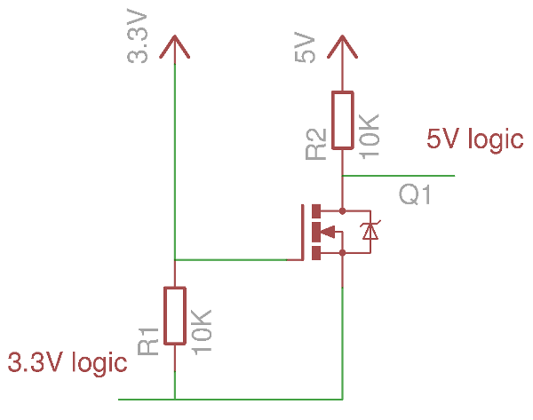

# Juicy Booth Teensy Led Firmware

## Setup Dev Environment

* Download Arduino software

* In the Arduino software, click File > Preferences. In "Additional boards manager URLs", copy this link `https://www.pjrc.com/teensy/package_teensy_index.json`
* In the main Arduino window, open Boards Manager by clicking the left-side board icon, search for "teensy", and click "Install". **For me v 1.59 did not work, but 1.58.2 does work**.
* Install Arduino libs *Artnet* and *FastLed*

## Hardware

* Leds: WS2812B RGB (Neopixel) Datasheet  https://www.mouser.com/pdfDocs/WS2812B-2020_V10_EN_181106150240761.pdf?srsltid=AfmBOopn6hdD0nUr_h_i0I6TTAt4FAZ8JJZVWGaKcjdeEGRCWYdkzq9v

* Might need a logic level shifter, from 3.3 to 5V (to be tested) Datasheet states a minimum high voltage rating of 0.7V, which sould be fine.

  * Level shift circuit using a MOSFET:

  